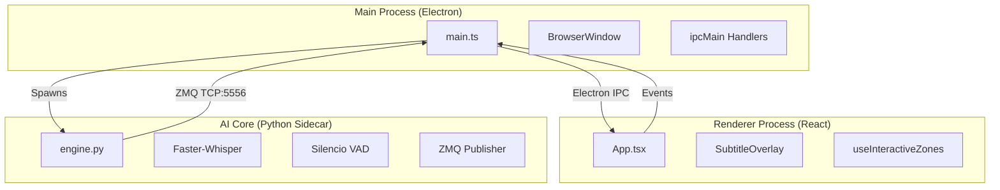

# 🏗️ System Architecture: Stealth Subtitle Translator

> **Technical Deep Dive & Internals**

Bu doküman, projenin iç yapısını, modüller arası haberleşmeyi (IPC), kullanılan AI modellerini ve "Stealth" mekanizmasının çalışma prensibini teknik detaylarıyla açıklar.

---

## 🧭 High-Level Overview

Proje, **Electron (Node.js)** ve **Python** olmak üzere iki ana process grubundan oluşan hibrit bir mimariye sahiptir.



---

## 🧠 1. AI Core (Python Engine)

Tüm yapay zeka işlemleri `python/engine.py` içinde, Electron ana sürecinden bağımsız bir *child process* olarak çalışır.

### Teknoloji Yığını
*   **STT Engine:** `faster-whisper` (CTranslate2 backend). Medium Model varsayılan olarak seçilmiştir. Apple Silicon üzerinde `int8` quantization ile çalışır.
*   **VAD (Voice Activity Detection):** `webrtcvad`. Sessizlik eşiği 400ms'ye indirilerek daha tepkisel hale getirilmiştir.
*   **Translation Layer:**
    *   *Tier 1 (Premium):* DeepL API. Fince gibi zor diller ve yüksek kalite için önceliklidir.
    *   *Tier 2 (Standard):* Google Translate. DeepL kotası biterse veya hata verirse devreye girer.
    *   *Tier 3 (Offline):* Argos Translate. İnternet kesilirse son çare olarak çalışır.
*   **Logic Controllers:**
    *   *Anti-Loop Filter:* Whisper'ın halüsinasyonlarını (sonsuz döngüleri) tespit edip temizleyen 3-gram filtresi.
    *   *Latency Optimizer:* Buffer sürelerini dinamik yöneterek (Max 5s) gecikmeyi minimize eder.

### Modes & Threading
İki farklı çalışma modu mevcuttur:
1.  **Fast Mode (Streaming):** `0.05s` aralıkla kelime kelime yayın yapar. Gecikme minimumdur.
2.  **Stable Mode (Strict):** Sadece `is_final=True` (cümle bitti) sinyali gelince yayın yapar. Yarım cümleleri asla göstermez.

Threading Model:
1.  `_audio_thread`: BlackHole'dan ham ses verisini okur.
2.  `_process_thread`: VAD, STT ve Çeviri işlemlerini yoğun işlemci gücüyle yönetir.


## ⚡ 2. IPC & Communication (ZeroMQ)

Standart `stdio` (stdin/stdout) iletişimi yüksek frekanslı ses verisi akışı için yetersiz kalacağından, endüstri standardı **ZeroMQ (ZMQ)** tercih edilmiştir.

### Protocol
*   **Pattern:** Publisher-Subscriber (PUB/SUB)
*   **Adres:** `tcp://127.0.0.1:5556`
*   **Format:**
    ```text
    [TRANSCRIPT] {"original": "Hello", "translated": "Merhaba", "is_final": false}
    [AUDIO_LEVEL] 0.54
    ```

Electron Main process bu portu dinler (`zmq.SUB`) ve gelen veriyi parse edip `mainWindow.webContents.send()` ile React arayüzüne iletir.

---

## 🛡️ 3. Stealth Mechanism (The Ghost Protocol)

Uygulamanın en kritik özelliği olan "Görünmezlik", macOS Window Server seviyesindeki hook'lar ile sağlanır.

### `NSWindowSharingNone`
`electron/main.ts` dosyasında şu satır sihirli dokunuşu yapar:

```typescript
win.setContentProtection(true);
```

Bu Electron API'si, arkaplanda macOS'un native `NSWindow.setSharingType(NSWindowSharingNone)` metodunu çağırır. Bu şu anlama gelir:
*   Pencere framebuffer'a çizilir (Kullanıcı görür).
*   Ancak `CGWindowListCreateImage` gibi ekran yakalama API'leri bu pencereyi **render etmeyi reddeder** (Şeffaf veya yok sayılır).
*   Sonuç: Zoom, Teams, OBS, QuickTime, Screenshot araçları pencereyi göremez.

---

## 👆 4. Interactive Click-Through (Smart Overlay)

Pencere tam ekran (`fullscreen`) olsa da, kullanıcı arkadaki uygulamalara (örn. Browser, IDE) tıklayabilmelidir. Ancak altyazı metnini seçebilmesi veya butonlara basabilmesi de gerekir.

Bu paradoks `useInteractiveZones` hook'u ile çözülmüştür:

1.  **Polling:** React tarafı her 200ms'de bir butonların ve metinlerin koordinatlarını (`rect`) hesaplar.
2.  **IPC Sync:** Bu koordinatları Main process'e gönderir.
3.  **Hole Punching:** Main process, bu koordinatlar **dışındaki** her yeri `setIgnoreMouseEvents(true, { forward: true })` yapar.

Böylece; butonun üzerine gelince mouse olaylarını Electron yakalar, boşluğa gelince tıklama arkadaki pencereye "düşer" (pass-through).

---

## 🧪 Testing Strategy

*   **Unit Tests:** Vitest + JSDOM (`src/__tests__`). UI bileşenlerinin ve mantığının testi.
*   **E2E (Planned):** Playwright Electron desteği ile tam entegrasyon testi.
*   **Security Audit:** OWASP standartlarına göre `webSecurity`, `contextIsolation` kontrolleri.
