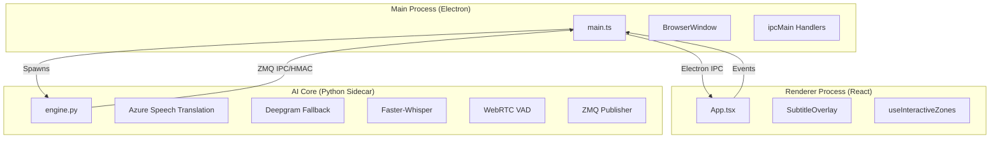

# System Architecture

Bu doküman, projenin iç yapısını, süreçler arası haberleşmeyi, kullanılan AI modellerini
ve "Stealth" mekanizmasının nasıl çalıştığını teknik detaylarıyla açıklar.

## Genel Bakış

Uygulama iki ana process grubundan oluşan hibrit bir mimariye sahiptir: **Electron (Node.js)**
arayüzü ve **Python** tarafında çalışan AI engine'i.



## 1. AI Core (Python Engine)

Tüm yapay zeka işlemleri `python/engine.py` içinde, Electron ana sürecinden bağımsız bir
*child process* olarak çalışır.

### Teknoloji Yığını

- **Cloud STT:** Azure Speech Translation ana motor; Deepgram yalnızca Azure kimlik
  bilgileri yoksa veya Azure kullanılamıyorsa devreye girer.
- **Local STT:** `faster-whisper` (CTranslate2 backend). Varsayılan model `small`;
  Apple Silicon'da `int8` quantization ile çalışır. Boyut (tiny/base/small/medium) kurulum
  sihirbazından seçilebilir.
- **VAD (Voice Activity Detection):** `webrtcvad` (kurulu değilse enerji tabanlı fallback).
  Sessizlik eşiği 350 ms — cümle bittikten sonra transkripsiyonu hızlıca finalize eder.
- **Çeviri katmanı:** DeepL API (önerilen, en kaliteli) → çevrimdışı Argos fallback.
  Canlı (partial) çevirilerde hızlı `latency_optimized` mod, cümle finalinde kaliteli
  `prefer_quality_optimized` mod kullanılır.
- **Koruma mekanizmaları:**
  - *Anti-loop filtresi:* Whisper'ın tekrar eden ifadelerini (örn. "on and on and on")
    tespit edip temizler.
  - *Cümle bütünlüğü:* Segment 6 saniyeyi aşarsa yarım kalan parça biriktirilir ve bir
    sonraki transkripsiyonla birleştirilir; altyazı bölünmüş cümle göstermez.
  - *CPU tasarrufu:* Canlı (partial) transkripsiyonlarda yalnızca son ~5 saniyelik ses
    işlenir; final transkripsiyonlar tam buffer kullanır.

### Modlar

- **Streaming (kelime modu, varsayılan):** Konuşmacı konuşurken kelime kelime canlı
  altyazı yayınlanır, cümle bitince netleşir.
- **Stable (cümle modu):** Yalnızca cümle tamamlanınca altyazı gösterilir; daha az
  zıplama, daha sakin okuma.

### Threading

1. Ses callback'i (`sounddevice`): BlackHole'dan ham ses parçalarını toplar.
2. `_process_thread`: VAD, STT ve çeviriyi yönetir; `_process_event` ile uyandırılır.
3. `_command_thread`: Electron'dan gelen yapılandırma komutlarını dinler (HMAC imzalı).

## 2. IPC & Haberleşme (ZeroMQ)

Yüksek frekanslı ses/transkript akışı için standart `stdio` yerine **ZeroMQ (ZMQ)**
kullanılır.

### Protocol

- **Pattern:** Publisher-Subscriber (PUB/SUB).
- **macOS transport:** Her oturum için ayrı Unix-domain socket çifti; macOS dışında
  `tcp://127.0.0.1:5555/5556` fallback.
- **Bütünlük:** Zarflar `v:1`, payload, `ts` ve HMAC-SHA256 imzası taşır; iki taraf da
  zaman penceresi ve tekrar kontrolü yapar.
- **Format örneği:**
  ```text
  [TRANSCRIPT] {"original": "Hello", "translated": "Merhaba", "isFinal": false}
  [AUDIO_LEVEL] 0.54
  [Status] downloading_model|small|460
  ```

Electron main process ZMQ subscriber'ı dinler; gelen transkriptleri parse edip
`mainWindow.webContents.send()` ile React arayüzüne iletir. Engine durum mesajları
(`[Status]`) aynı kanaldan `engine-status` IPC olayına çevrilir.

## 3. Stealth Mekanizması

Uygulamanın en kritik özelliği: ekran paylaşımından görünmez olma. macOS Window Server
seviyesindeki pencere paylaşım koruması ile sağlanır.

```typescript
mainWindow.setContentProtection(true);
```

Bu API, macOS'un native pencere paylaşım korumasını açar:

- Pencere framebuffer'a çizilir (kullanıcı görür).
- `CGWindowListCreateImage` gibi ekran yakalama API'leri bu pencereyi render etmez.
- Sonuç: Zoom, Teams, OBS, QuickTime ve ekran görüntüsü araçları pencereyi göremez.

Varsayılan açılış modu görünürdür; kullanıcı Stealth düğmesine basınca koruma açılır.
Ekran görüntüsü almak için görünür modda kalmak gerekir.

## 4. Interactive Click-Through

Pencere ekranı kaplasa da kullanıcı arkadaki uygulamalara tıklayabilmelidir; aynı anda
altyazıya tıklayıp butonlara basabilmesi de gerekir. Bu paradoks `useInteractiveZones`
hook'u ile çözülür:

1. React tarafı düzenli aralıklarla buton ve metinlerin koordinatlarını hesaplar.
2. Koordinatlar IPC ile main process'e gönderilir.
3. Main process, bu koordinatlar **dışındaki** alanı
   `setIgnoreMouseEvents(true, { forward: true })` yapar — boşluk tıklamaları arkadaki
   pencereye düşer, etkileşimli öğeler normal çalışır.

## Test Stratejisi

- **Unit testler:** Vitest + JSDOM (`src/__tests__`, `src/components/__tests__`).
- **E2E smoke test:** Playwright + Electron (`e2e/smoke.spec.ts`) — uygulama boot olur,
  pencere açılır.
- **CI:** GitHub Actions — type check, unit test, `npm audit`, `pip-audit`, ruff lint/format.
- **Güvenlik kontrolleri:** `contextIsolation`, sandbox ve `webSecurity` prod build'lerde
  açıktır.
