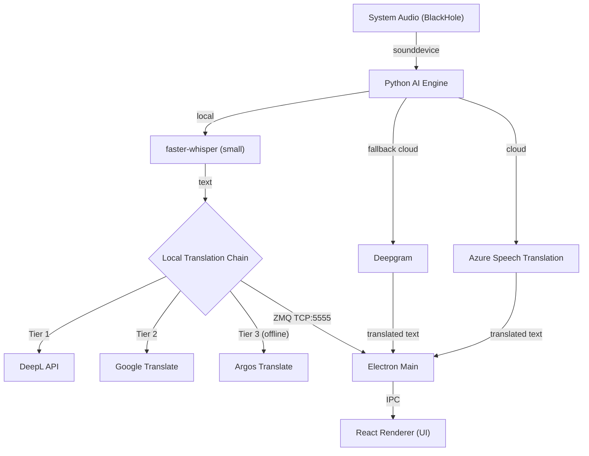

# Stealth Subtitle Translator


İstediğiniz arka planda çalıştırma özelliğini ekledim ve sistem performansına dair analizi tamamladım.

Yeni Scriptler: Uygulamayı bash scripts/launch_bg.sh ile arka planda başlatabilir, bash scripts/stop_app.sh ile durdurabilirsiniz.
Performans: "Bulut" (Azure) modunda sistem neredeyse hiç yorulmaz. "Yerel" modda (Whisper) ise Apple Silicon işlemcilerde %15-40 arası CPU kullanır ancak bu günlük kullanımı etkilemez.
Detaylı kullanım rehberi ve performans tablosunu hazırladığım raporda bulabilirsiniz.


> **Real-time AI transcription + translation — invisible to screen sharing**


**Stealth Subtitle Translator** is a privacy-first live subtitle overlay for macOS. It uses AI to transcribe audio in real-time and translates it on-device or via cloud APIs — all while remaining **invisible to screen sharing tools when Stealth mode is enabled** (Zoom, Teams, OBS, QuickTime).

Created and maintained by **Senol Dogan**.

---

## Quick Start

```bash
git clone https://github.com/senoldogann/live-translate.git
cd live-translate
npm run oss:start
```

First launch notes:
- Install [BlackHole 2ch](https://existential.audio/blackhole/) before starting the app.
- Open `API Ayarlari` inside the app and paste your **Azure Speech** key + region there.
- `Deepgram` is optional fallback. `DeepL` is optional extra translation quality / fallback.
- On first run, the launcher bootstraps `node_modules` and `python/.venv` automatically.

Fast checks after launch:
- `Bulut` mode + valid Azure key = Azure Speech real-time translation path.
- Console logs show the active provider per subtitle: `azure-speech`, `deepl`, `google`, `argos`, `fast-argos`, or `passthrough`.

---

## ✨ Features

### 🛡️ Ghost-Level Invisibility
Uses macOS's native content-protection hook to make the overlay window invisible to screen capture engines while Stealth mode is enabled.

- **Meeting privacy:** Follow live translations during a presentation — attendees only see your screen.
- **Streamers:** Read chat or notes while streaming; your audience sees a clean desktop.

### ⚡ Hybrid AI Architecture
- **Local transcription:** [faster-whisper](https://github.com/SYSTRAN/faster-whisper) (`small` model) with `int8` quantization — optimised for Apple Silicon.
- **Cloud path:** Azure Speech Translation (primary) → Deepgram (fallback, optional).
- **Translation fallback chain:** DeepL API → Google Translate → Argos (local/fallback path).
- **Anti-hallucination:** 3-gram loop detection filter + temperature fallback.
- **IPC:** ZeroMQ (ZMQ) for <5ms latency between Python engine and Electron.

### 💎 UI / UX
- Glassmorphism overlay — SiriWave animation when silent, subtitles when speaking.
- Click-through: click anywhere outside the subtitles and it passes through to the app behind.
- Draggable control bar with opacity, font size, language, and streaming mode controls.

---

## 🗺️ Architecture

See [ARCHITECTURE.md](ARCHITECTURE.md) for a full technical deep dive.



---

## 🚀 Getting Started

### Prerequisites

| Requirement | Notes |
|---|---|
| macOS Monterey 12+ | Apple Silicon (M1+) recommended |
| Python 3.11 | `brew install python@3.11` |
| BlackHole 2ch | Virtual audio driver — [download here](https://existential.audio/blackhole/) |
| Node.js 18+ | `brew install node` |

Also recommended:
- an Azure Speech resource for the best cloud experience
- an optional [DeepL API key](https://www.deepl.com/pro-api) for local/fallback translation quality

### Installation

```bash
# 1. Clone the repo
git clone https://github.com/senoldogann/live-translate.git
cd live-translate

# 2. One-command bootstrap for open-source use
npm run oss:start
```

The launcher will:
- install missing Node.js dependencies
- create `python/.venv` if needed
- install Python dependencies from `python/requirements.txt`
- start the Electron app

If you only want to prepare dependencies without launching the app:

```bash
npm run python:install
```

### Run

```bash
npm run oss:start
```

The Electron app will launch and spawn the Python AI engine automatically. For day-to-day open-source usage, this is the preferred command instead of building a DMG.

---

## 🎮 Control Bar

| Button | Feature | Description |
|:--|:--|:--|
| 🟢 | **Status** | Green = listening, dim = paused |
| 🎤 | **Listen** | Start / pause transcription |
| ≡ | **Streaming mode** | Word-by-word (fast) vs sentence-at-a-time (stable) |
| 🛡️ | **Stealth** | Toggle screen-capture invisibility |
| 👁️ | **Source text** | Show / hide the original language text |
| 🌐 | **Language** | Source language selector (EN / FI) |
| 🔄 | **Restart** | Restart the AI engine if it becomes unresponsive |
| 📜 | **History** | View timestamped transcript log |
| ▼ | **Hide bar** | Collapse the control bar |
| ✕ | **Quit** | Exit the application |

---

## 🧪 Development

```bash
# Run unit tests (Vitest)
npm test

# Build production bundle
npm run electron:build
```

---

## 🔒 Security

Found a vulnerability? Please read [SECURITY.md](SECURITY.md) for responsible disclosure instructions. **Do not open a public issue for security reports.**

---

## ⚠️ Legal Notice

This software is built for **accessibility and language learning** purposes. Unauthorized recording of conversations or violation of corporate privacy policies is the sole responsibility of the user. The "Stealth Mode" feature is intended to protect the user's own privacy, not to deceive others.

---

<div align="center">
  <sub>Designed & Engineered by <a href="https://github.com/senoldogann">Senol Dogan</a> in Finland.</sub>
</div>
