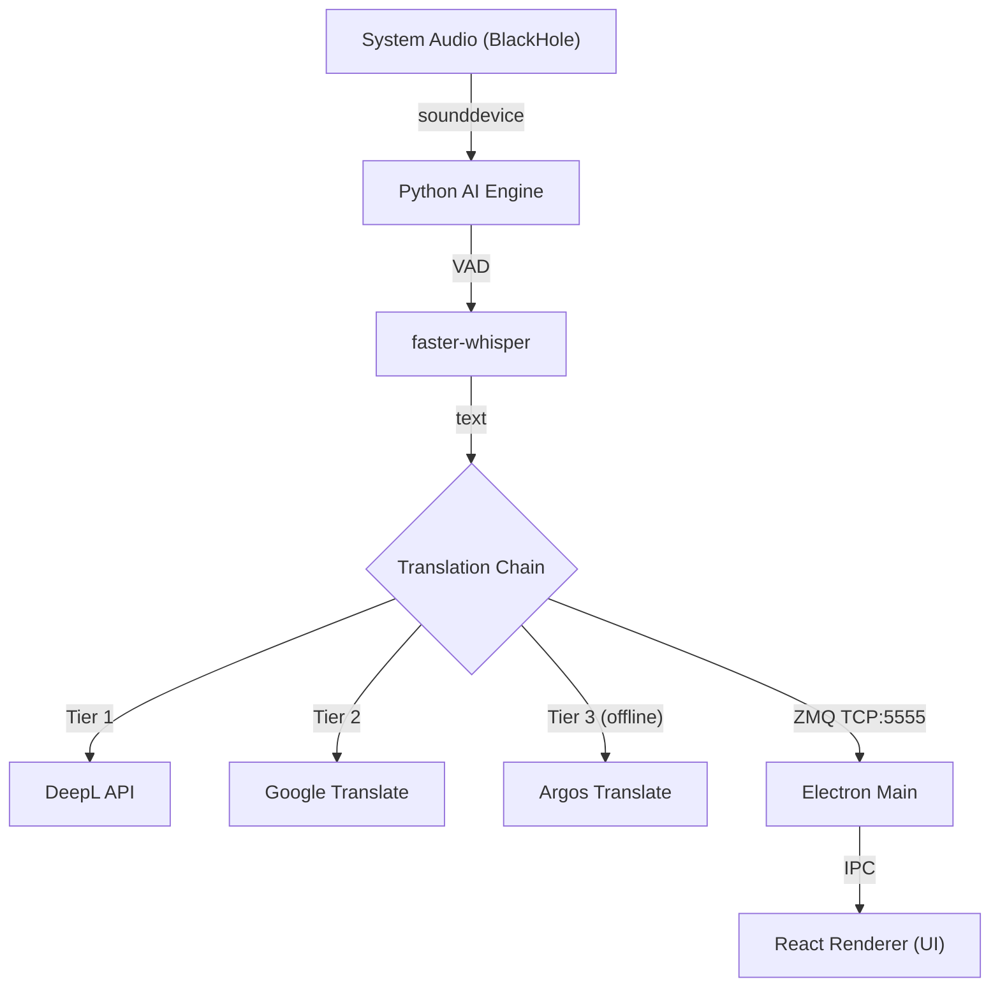

# Stealth Subtitle Translator

> **Real-time AI transcription + translation — invisible to screen sharing**


**Stealth Subtitle Translator** is a privacy-first live subtitle overlay for macOS. It uses AI to transcribe audio in real-time and translates it on-device or via cloud APIs — all while remaining **completely invisible to screen sharing tools** (Zoom, Teams, OBS, QuickTime).

---

## ✨ Features

### 🛡️ Ghost-Level Invisibility
Uses macOS's native `NSWindowSharingNone` API to make the overlay window invisible to any screen capture engine.

- **Meeting privacy:** Follow live translations during a presentation — attendees only see your screen.
- **Streamers:** Read chat or notes while streaming; your audience sees a clean desktop.

### ⚡ Hybrid AI Architecture
- **Transcription:** [faster-whisper](https://github.com/SYSTRAN/faster-whisper) (Medium model) with `int8` quantization — optimised for Apple Silicon.
- **Translation fallback chain:** DeepL API → Google Translate → Argos (offline).
- **Anti-hallucination:** 3-gram loop detection filter + temperature fallback.
- **IPC:** ZeroMQ (ZMQ) for <5ms latency between Python engine and Electron.

### 💎 UI / UX
- Glassmorphism overlay — SiriWave animation when silent, subtitles when speaking.
- Click-through: click anywhere outside the subtitles and it passes through to the app behind.
- Draggable control bar with opacity, font size, language, and streaming mode controls.

---

## 🗺️ Architecture

See [ARCHITECTURE.md](ARCHITECTURE.md) for a full technical deep dive.



---

## 🚀 Getting Started

### Prerequisites

| Requirement | Notes |
|---|---|
| macOS Monterey 12+ | Apple Silicon (M1+) recommended |
| Python 3.11 | `brew install python@3.11` |
| BlackHole 2ch | Virtual audio driver — [download here](https://existential.audio/blackhole/) |
| Node.js 18+ | `brew install node` |

Also recommended: a free [DeepL API key](https://www.deepl.com/pro-api) for higher-quality translations.

### Installation

```bash
# 1. Clone the repo
git clone https://github.com/senoldogann/live-translate.git
cd live-translate

# 2. Install Node.js dependencies
npm install

# 3. Set up the Python virtual environment and install AI dependencies
npm run python:install

# 4. Configure environment variables (optional but recommended)
cp .env.example .env
# Edit .env and add your DEEPL_API_KEY
```

### Run

```bash
npm start
```

The Electron app will launch and spawn the Python AI engine automatically.

---

## 🎮 Control Bar

| Button | Feature | Description |
|:--|:--|:--|
| 🟢 | **Status** | Green = listening, dim = paused |
| 🎤 | **Listen** | Start / pause transcription |
| ≡ | **Streaming mode** | Word-by-word (fast) vs sentence-at-a-time (stable) |
| 🛡️ | **Stealth** | Toggle screen-capture invisibility |
| 👁️ | **Source text** | Show / hide the original language text |
| 🌐 | **Language** | Source language selector (EN / FI) |
| 🔄 | **Restart** | Restart the AI engine if it becomes unresponsive |
| 📜 | **History** | View timestamped transcript log |
| ▼ | **Hide bar** | Collapse the control bar |
| ✕ | **Quit** | Exit the application |

---

## 🧪 Development

```bash
# Run unit tests (Vitest)
npm test

# Lint
npm run lint

# Build production bundle
npm run electron:build
```

---

## ⚠️ Legal Notice

This software is built for **accessibility and language learning** purposes. Unauthorized recording of conversations or violation of corporate privacy policies is the sole responsibility of the user. The "Stealth Mode" feature is intended to protect the user's own privacy, not to deceive others.

---

<div align="center">
  <sub>Designed & Engineered by <a href="https://github.com/senoldogann">Senol Dogan</a> in Finland.</sub>
</div>
